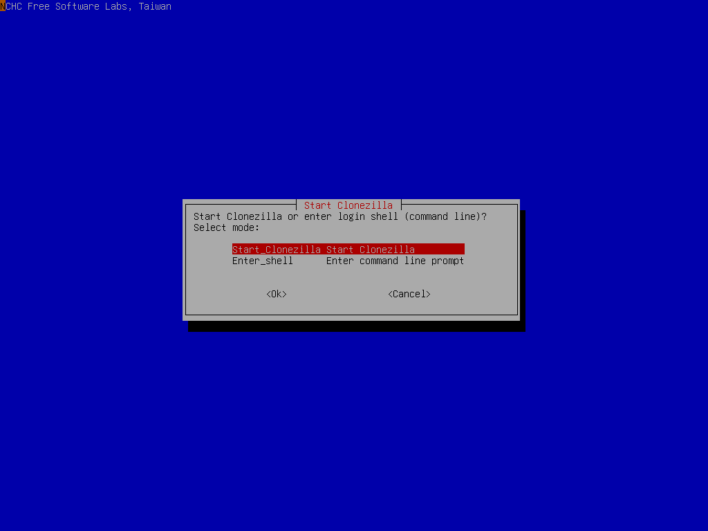

I think most of us have had to deal with it—that one HP laptop we've had for a few years that has always taken a few years to load anything on a good day. No matter how many applications you clean off of the computer, or how many times you download free RAM off of the internet (please don't do this), you still can't get anything to run smoothly on your computer.

Maybe you have since ditched the computer in question, thinking it's a lost cause. But with a single, easy upgrade, you can make that computer feel almost as good as new. And this upgrade is even great for laptops, despite their small size.

## Why your computer is so slow

Your computer is made up of many different parts and pieces. You have the motherboard, the CPU, the GPU, RAM, and storage. And those are just the big ones that most people have heard of.

A good CPU is able to do billions of small operations every second. The CPU, which stands for central processing unit, is what makes your computer do things. It processes data. A fast processor can make your computer very fast. But, in your old computer, it's likely not the performance bottleneck.

GPUs, also referred to graphics processor unit, or a graphics card, process the pixels that go to your screen. If you like playing games on your computer or you use other 3D software, you want a good GPU. The difference between the structure of a GPU and a CPU is that the GPU has a ton of small cores which are able to process things simultaneously, while a cpu only has a few powerful cores. While a great graphics card could potentially dramatically improve the visuals of your games, it's also probably not the issue.

Random access memory (RAM) is where programs on your computer get loaded into. The memory can be sent to and from the CPU super quickly, far faster than even the fastest of storage options today. High RAM capacity means you can have more application information loaded at a single time. Dedicated graphics cards have their own kind of RAM—VRAM, or video-RAM. VRAM is usually designed right into the GPU, so it's not something you can just upgrade when you feel like it.

The motherboard is the electronics board that connects all of these individual things together with different kinds of electrical interfaces. The type of motherboard you have is likely dependent upon the type of CPU you have, as different processors have different socket types and motherboard types that they support.

Finally, we get to where the bottleneck most likely it: storage. But wait... my computer tells me that I still have hundreds of gigabytes to spare—how would my storage be the bottleneck? Well, there are two main different kinds of storage that computers use. There is the HDD (hard disk drive) and the SSD (solid state drive).

An HDD is the traditional storage type which features a spinning disk and uses magnetic cells to represent the "ones and zeros." It uses a magnetic arm to read and write data across the disk. These devices can be very slow to read and write data by modern standards, but they are usually much cheaper per unit of storage.

SSDs are a more modern approach to storage. They use transistors to store memory, meaning they don't need any moving parts. SSDs are almost always much faster than traditional hard drives. For this reason, solid state drives have been the recommended storage option to boot from for as long as they have been affordable. Unfortunately, they are still more expensive per unit of storage than HDDs and as a result, your budget laptop from a few years ago probably was fitted with a traditional hard drive. This means slow load times for *everything*.

## How do we fix this bottleneck?

First of all, HDDs are still great. They can store a ton of data for relatively cheap. However, it's completely unwise to boot a modern OS such as Windows 10/11 off of a hard drive. Many modern desktops are set up with an SSD for the main storage and OS, with an HDD as additional storage for media and used applications that are used less frequently.

But since your old computer is likely running its operating system right off of its ancient spinning hard drive, replacing that drive with an SSD could decrease your computer's loading times by over 500%, depending on the current HDD and the SSD you are replacing it with. 

My amazing fiancee's laptop has been loading very slow recently, causing endless frustration when trying to do schoolwork and other important tasks. Knowing what the bottleneck is, I set a goal for myself to drastically improve the performance of her laptop.

### Finding an SSD

You'll want to find a new SSD from a trustworthy source in at least the same amount of storage as your current drive. Replacing the drive won't be as easy as taking the old one out and putting the new one in. We'll need to completely clone the old drive to the new one, so to make things simpler, you will want to get an SSD of at least the size of the original drive.

Places such as Newegg and Best Buy offer good SSDs from good brands. Make sure to read the reviews to make sure the drive is fast and durable. You'll also want to make sure that your computer uses SATA to connect to the HDD. Then, make sure that the SSD you purchase also uses SATA.

Because my fiancee's laptop is a whopping 2TB, I went with [this drive](https://www.newegg.com/sandisk-2tb-ssd-plus/p/N82E16820173423?Item=N82E16820173423) as a replacement. It's a big and fast SSD from a well-known company.

Because we'll need to connect the new drive externally, you're going to also need a USB SATA cable or enclosure, such as [this one](https://a.co/d/979yoUg). Make sure the cable you get supplies power to the drive as well as connects to the computer via USB.

### Back up your current drive

During the cloning process, if something goes wrong or you select the wrong option, you could lose all your data. Be safe and back everything up first! I was foolish and skipped this step, but I got lucky not to have anything go wrong. Don't be like me! Back up, back up, back up!

### Cloning the drive

The next step is the most challenging. I like to use software called [*Clonezilla*](https://clonezilla.org) to completely clone the old drive to the new one. Clonezilla operates as its own OS, running on a USB drive using Debian Linux. It's complicated to set up, but a helpful tutorial can be found on their site [here](https://clonezilla.org/fine-print-live-doc.php?path=./clonezilla-live/doc/03_Disk_to_disk_clone/00-prepare-clonezilla-live.doc#00-prepare-clonezilla-live.doc). Remember, be careful when using Clonezilla, it could completely and permanently delete your data if you do something wrong, so like I already said, back up your PC!

There are other more user-friendly cloning options out there, but Clonezilla is free and open source. That's my favorite kind of software.

### Installing the drive

Finally it's time to put your fancy new piece of hardware inside your computer. Every computer is a little different, so you'll have to find steps to get to the hard drive. After you get the computer open, it's usually as simple as undoing a couple screws, unplugging the old one, and plugging the new SSD in! Put everything back together and boom, your old computer will run better than ever.

### Finishing up

Now you have a computer that loads programs and Windows blazing fast. If you want to further improve your performance, some additional things you could do are remove some startup problems and remove old applications and/or data.

---

While this article isn't meant to be a full in-depth tutorial, I hope you were able to see that with a little work, you can improve the performance of your old PC by a significant amount.
